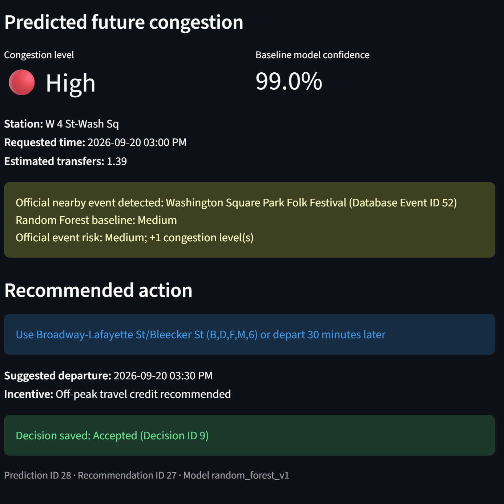
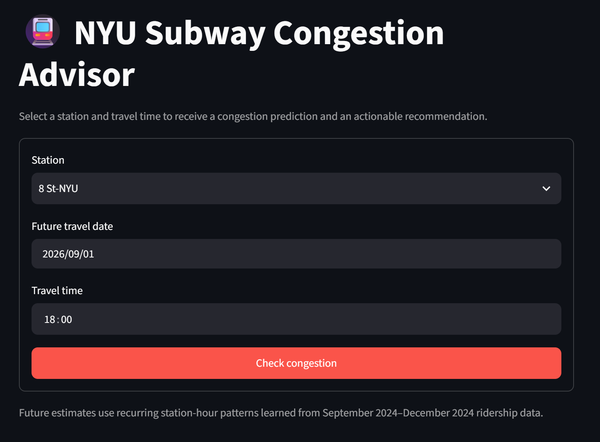
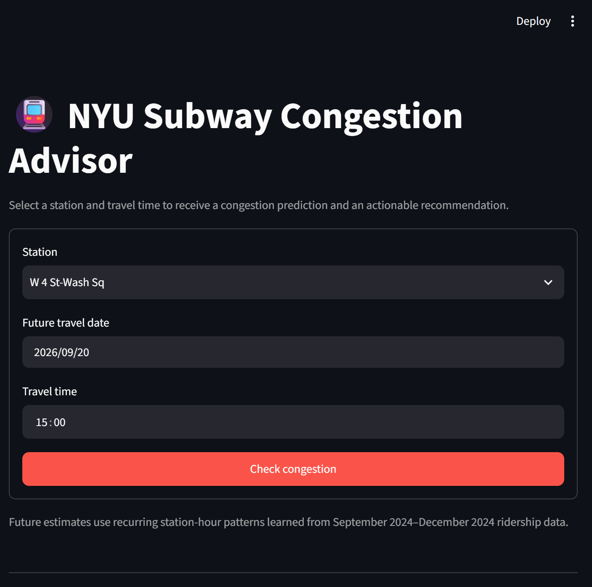
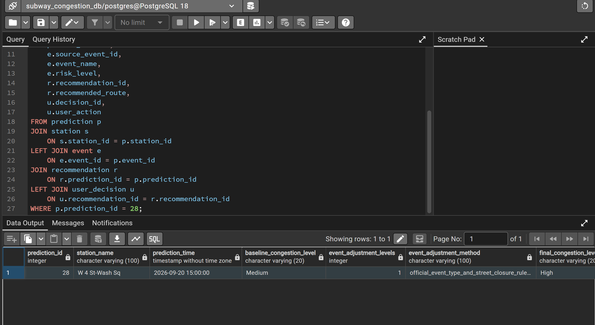

# Subway Congestion Decision Support Platform

An end-to-end decision support application that combines historical MTA ridership data, PostgreSQL, machine learning, and persistent recommendation tracking to predict subway congestion around the NYU area and support commuter travel decisions.

Originally developed as a Database Systems project for **CSCI-GA.2433-001 at New York University**.

## Demo

The application accepts a future subway trip request, incorporates relevant event context, predicts congestion, generates a recommendation, and persists the resulting commuter decision in PostgreSQL.



<details>
<summary>View additional workflow screenshots</summary>

### Future Trip Request


### Event-Aware Request


### Database Audit


</details>

## Tech Stack

- **Backend & Database:** Python, PostgreSQL, SQLAlchemy
- **Application:** Streamlit
- **Machine Learning:** scikit-learn, Random Forest
- **Data:** MTA historical ridership data, NYC Open Data API
- **Development:** Git, environment-based configuration

## Key Features

- Stores and queries historical subway ridership data in PostgreSQL.
- Predicts congestion for a selected station, date, and time using a persisted Random Forest model.
- Generates travel recommendations based on predicted congestion conditions.
- Persists predictions, recommendations, and commuter decisions for end-to-end tracking.
- Integrates historical MTA ridership data with external event data.
- Separates database credentials and environment-specific configuration from source code.

## End-to-End Workflow

1. Validate and load 11,667 hourly ridership observations into PostgreSQL.
2. Accept a future station, date, and time through the Streamlit interface.
3. Retrieve the required data and prepare model features.
4. Load the persisted Random Forest model and predict congestion.
5. Store the prediction in `PREDICTION`.
6. Generate and store the associated recommendation in `RECOMMENDATION`.
7. Record whether the commuter accepts the recommendation or keeps the original plan in `USER_DECISION`.

This creates a persistent workflow connecting:

`Ridership Data → Prediction → Recommendation → User Decision`

## Database Design

The application uses PostgreSQL to maintain persistent application state across the prediction and recommendation workflow.

Core entities include:

- `PREDICTION` — stores generated congestion predictions.
- `RECOMMENDATION` — stores recommendations associated with predictions.
- `USER_DECISION` — records the commuter's final decision.
- Historical ridership data — provides the observations used by the prediction workflow.

The relationships between these records allow predictions, recommendations, and user decisions to be traced through the complete workflow.

## Project Structure

The primary implementation is located in [`part4/`](./part4).

```text
subway-congestion-platform/
├── part4/
│   ├── app.py                         # Streamlit application entry point
│   ├── database.py                    # Database connection and configuration
│   ├── models.py                      # SQLAlchemy data models
│   ├── prediction_service.py          # Congestion prediction workflow
│   ├── recommendation_service.py      # Recommendation generation and persistence
│   ├── user_decision_service.py       # Commuter decision tracking
│   ├── event_service.py               # External event data integration
│   ├── load_data.py                   # Ridership data loading
│   ├── train_model.py                 # Random Forest model training
│   ├── run_pipeline.py                # Data/model pipeline orchestration
│   ├── analyze_queries.py             # Database query analysis
│   ├── sql/                           # SQL scripts and database setup
│   ├── automation/                    # Automated data/model workflows
│   ├── artifacts/                     # Persisted model artifacts
│   ├── data/                          # Project data
│   ├── docs/                          # Supporting documentation
│   ├── screenshots/                   # Application screenshots
│   ├── requirements.txt               # Python dependencies
│   └── .env.example                   # Environment configuration template
├── .gitignore
└── README.md
